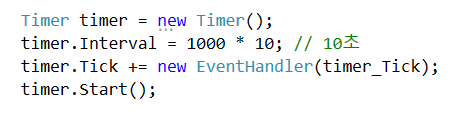

# 개요

QR 코드가 부착된 물품이 오류인지 판별하는 프로그램입니다.
이 프로그램을 통해서 사용자는 날짜별로 정상과 오류 물품의 개수를 확인할 수 있습니다.

(시연 동영상 : https://www.youtube.com/watch?v=1WmiCw99rDA)

# 사용기술

### 언어
* C# 3.0+, Python 3.7

### 프레임워크
* .Net Framework
* ASP.Net Web API
* Entity Framework
* Winform

### 데이터베이스
* MSSQL Server 2019

### Third Party Control
* DevExpress Winform

# 데이터베이스 테이블

IsDefective가 true이면 오류 false면 정상 제품입니다.

# 설명

## 1. 구현 내용

### 1-1 아두이노 -> 라즈베리 파이

초음파 센서가 물품을 탐지하면 아두이노는 라즈베리 파이에 물품의 오류를 판별하라는 신호를 Serial 통신으로 보냅니다.

### 1-2 OpenCv를 이용해서 오류 판별

라즈베리 파이 카메라 5 mp 모듈은 제품에 부착된 QR 코드로 오류를 판별합니다.
QR 코드 데이터는 Python zbar 라이브러리를 이용했습니다.
(저희는 임의로 QR 코드가 4자리가 아니면 오류로 판별했습니다.)

QR 코드가 인식되면 화면에 빨간색 네모 박스를 그려줍니다.

### 1-3 라즈베리 파이 -> Web API

QR 코드 데이터를 Python requests 라이브러리를 이용해 JSON 형식으로 Web API에 전송합니다.

### 1-4 Web API -> DB
  

ASP.Net Web API 응용프로그램을 IIS(Internet Information Sevices)에 배포해서 서버를 구축했습니다.
서버에 도착한 QR 코드 데이터는 요청에 따라 DB에 삽입, 삭제, 수정, 읽기를 수행합니다.  

  

전송된 QR코드 데이터는 차례대로 DB에 저장됩니다. 

### 1-5 DB 데이터 모니터링

사용자는 실시간으로 날짜별 정상, 오류 제품의 개수를 모니터링할 수 있습니다.
실시간으로 DB를 모니터링하기 위해 Timer 클래스를 이용해 10초마다 DB에 저장된 물품의 개수를 확인했습니다.

# Point Of Interset
## 1. UnitTest Test Explorer 하는 과정에서 시스템 오류 문제

### 증상
* 시스템 오류: 애플리케이션 구성 파일에서 ProductClassificationEntities 라는 이름의 연결 문자를 찾을 수 없었습니다.

### 원인
* App.config파일에  <connectionStrings> 추가를 하지 않아서였습니다.

### 해결
* App.config파일에  <connectionStrings> 추가하여 해결했습니다.

 
## 2. 제품을 실시간으로 차트에 띄우는 문제 
### 증상

* Chart에 정상 제품과 오류 제품의 개수를 실시간으로 나타내기 어려웠습니다.  

### 해결
* 이를 해결하기 위해 Timer 클래스를 사용하여 해결했습니다.

### 개선사항
* 저희가 Timer 클래스로 문제를 해결했지만, 완성 후에 차트를 실시간으로 나타낼 수 있는 real time 차트가 있다는 것을 알았고 다음에는 이것을 사용해야겠다고 느꼈습니다.

## 3. 컨베이어 벨트 동작 문제

### 증상
* 컨베이어 벨트를 아두이노로 동작시킬 때 어려움이 있었습니다.

### 해결
* 컨베이어 벨트가 모터와 가변저항으로 구성된 것을 알게 되어 가변저항에 아날로그 신호를 보내서 컨베이어 벨트를 동작시켰습니다.

## 4. ASP.NET Web API 응용프로그램 배포 문제

### 증상
* ASP.NET Web API 응용프로그램을 IIS에 배포할 때 어려움을 느꼈습니다.  

### 해결
* 수업내용을 복습하여 해결하였습니다.

### 개선사항
* 이번에는 Windows Server를 사용했지만, .NET Core 를 사용하여 Linux 환경에서 다시 한번 구현해보고 싶습니다.

